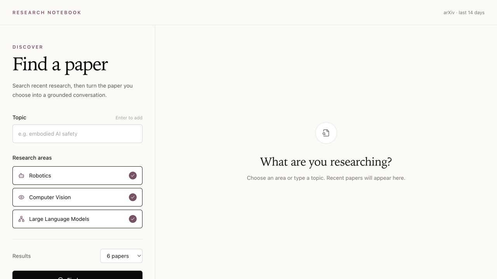
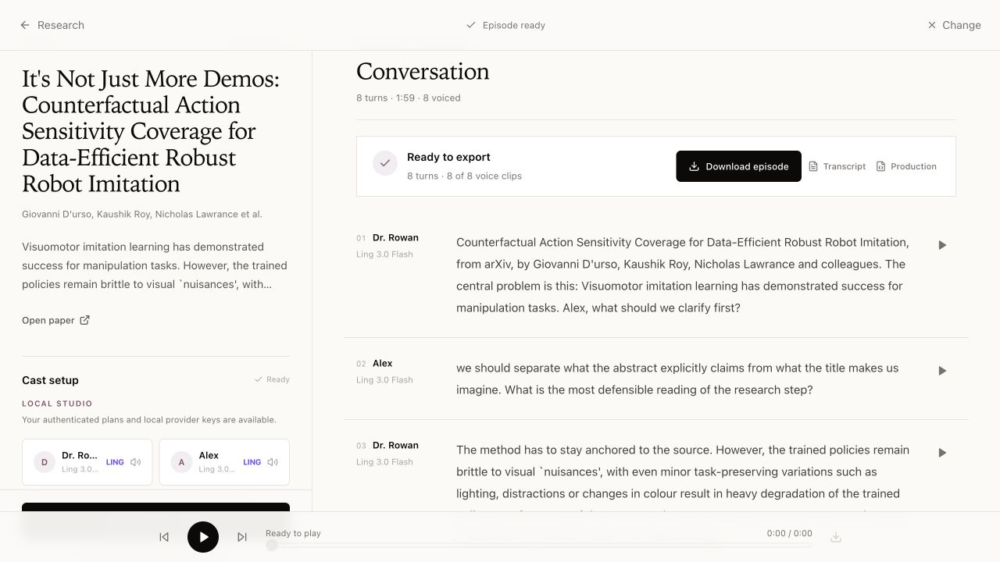

# Research Notebook

Turn recent research papers into grounded, multi-model conversations with optional AI voices.

[Try the live studio](https://ai-research-gather.vercel.app/) · [Sergio Peschiera](https://www.sergiopesch.com/)



## What it does

- Finds recent arXiv papers by research area or custom topic.
- Gives each speaker an independently selected model and voice.
- Generates progressive conversations of up to 20 turns.
- Plays the finished episode and exports its audio, transcript, and production data.



## Run locally

Requires Node.js 24 and npm.

```bash
nvm use
npm ci
cp .env.example .env.local
npm run dev
```

Open [localhost:8080](http://localhost:8080). Demo mode works without a provider key. Add only the providers you want to use to `.env.local`.

## Access

| Experience | Access |
| --- | --- |
| Hosted demo | Free, limited generation on supported shared models |
| Private studio | Owner access to configured server-side providers |
| Local studio | Your own provider keys or supported ChatGPT and Grok command-line sessions |

Provider secrets stay on the server and generated audio stays in the browser until it is exported.

## Useful commands

```bash
npm run check
npm run check:ci
```

## License

MIT
